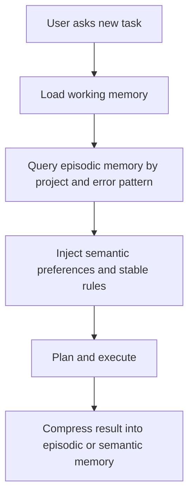

# 记忆不是缓存：AI Agent 为什么需要分层记忆设计

很多团队第一次做 Agent，会把“记忆”理解成继续往 prompt 里塞上下文。短期看，这招确实有效：上一轮对话、工具输出、用户要求一起带上，模型就会显得更“记得事”。但只要系统进入真实工作流，问题很快就会暴露：上下文越堆越长，成本越抬越高，噪声越积越多，真正关键的状态反而越来越难定位。

我更愿意把 Agent 的记忆看成一个**分层的信息系统**，而不是一个不断膨胀的对话缓冲区。稳定的 Agent 不是“什么都记住”，而是清楚**什么该随任务即时注入，什么该长期保存，什么该在任务结束后丢弃，什么必须先结构化，才能在需要时可靠检索回来**。如果这层边界没有设计好，模型能力越强，系统反而越容易在复杂任务里暴露出一种很别扭的脆弱：表面聪明，一跨 session、一跨工具、一跨时间窗口，就开始失真。

## 先分清三类记忆

一个可维护的 Agent 系统，通常至少需要三层记忆：

1. **工作记忆（working memory）**：当前任务真正需要的上下文。
2. **情境记忆（episodic memory）**：过去做过什么、遇到过什么问题、最后怎么解决。
3. **语义记忆（semantic memory）**：用户偏好、稳定规则、系统约束、长期有效的知识。

如果把这三层混在一起，系统就会同时出现两个极端：
- 要么每轮都塞一大堆旧信息，导致推理负担越来越大；
- 要么为了节省 token 丢得太狠，结果 Agent 每次都像第一次认识你。

> 好的记忆系统不是“全都记住”，而是“按用途组织记忆”。

### 工作记忆关注“现在要做什么”

工作记忆更像 CPU cache。它应该足够新、足够短、足够贴近当前任务。比如：
- 用户这轮要求输出什么格式；
- 刚刚调用工具得到的结果；
- 当前文件路径、分支名、报错栈；
- 临时 TODO 与阶段目标。

它的特点不是“重要”，而是**立即相关**。一旦任务结束，大部分工作记忆都应该被压缩、归档，或者直接丢弃。

### 情境记忆关注“上次怎么做的”

情境记忆更像案例库。它记录的是：
- 上次这个项目为什么失败；
- 某个 cron 为什么超时；
- 某次登录问题最后是怎么绕过的；
- 某个 bug 修复后对应的验证方式。

它最有价值的地方，不是给模型“回忆感”，而是降低重复踩坑概率。

### 语义记忆关注“稳定事实”

语义记忆是长期有效、跨任务复用的那一层，比如：
- 用户偏好叫你怎么称呼他；
- 某个仓库的固定路径；
- 默认输出风格；
- 系统中的硬约束。

这类信息应该短、小、稳定，而且最好可显式更新。

## 什么时候该写入，什么时候不该写入

最常见的错误，不是“没记住”，而是**什么都想记**。

- 临时 shell 输出，不该进长期记忆。
- 一次性 TODO，不该进用户画像。
- 偶然性的失败，也不该立刻当成稳定规则。

我更推荐下面这个判断框架：

| 信息类型 | 应不应该长期保存 | 推荐去向 |
|---|---|---|
| 当前命令输出 | 否 | 工作记忆 |
| 本次任务过程 | 视情况 | session/轨迹 |
| 用户稳定偏好 | 是 | 语义记忆 |
| 一次排障案例 | 是 | 情境记忆 / runbook |
| 临时变量 | 否 | 丢弃 |

如果一条信息未来**大概率会让用户少重复一句话、少纠正一次、少踩一个坑**，那它通常值得进入长期层。否则，尽量别污染长期记忆。

## 为什么结构化比“原样堆上下文”更重要

很多 Agent 在早期都能靠堆上下文跑起来，但一旦任务复杂，就会出现一个问题：模型虽然“见过”信息，却**取不出来**。这不是记忆量不够，而是组织方式太差。

比如下面这段 TypeScript，更接近一个可维护的记忆模型：

```ts
interface MemoryRecord {
  id: string;
  layer: 'working' | 'episodic' | 'semantic';
  summary: string;
  tags: string[];
  updatedAt: string;
  source?: string;
}

function shouldPersist(record: MemoryRecord): boolean {
  return record.layer !== 'working' && record.summary.trim().length > 0;
}
```

这里真正重要的不是语法，而是思路：**先决定记忆属于哪一层，再决定怎么存。** 如果没有层次，检索和压缩都会变得粗糙。

## 让记忆真正可检索，而不是可堆积

当 Agent 开始跨会话工作时，检索能力往往比“记住更多”更重要。你需要的不是把所有历史都塞给模型，而是能在正确的时候把正确的那几条捞出来。

这时通常会需要：
- 标签（例如 `project`, `user_pref`, `tool`, `bugfix`）
- 时间信息
- 简短摘要
- 与实体的关联（人、项目、文件、任务）

### 一个简单的检索流



这个流程的关键不是“全自动”，而是**把注入时机和记忆层绑定起来**。不同层，在不同时间进入上下文。

## 文章内图片测试

下面这张图不是为了表达内容本身，而是用来验证 markdown2img 对文章内本地图片引用的支持：


## 设计记忆系统时最容易忽略的细节

### 1. 记忆需要衰减，不需要永生
并不是所有历史都值得一直参与推理。很多信息过一段时间就应该降权，甚至直接归档。否则系统会慢慢被旧约束绑死。

### 2. 用户偏好要能被纠错
如果用户说“不要再这样做”，那是一条比很多技术细节更重要的长期记忆。偏好写入之后，也要允许 replace，而不是只会 append。

### 3. 失败经验往往比成功经验更值钱
成功可能只是流程顺滑；失败通常暴露边界。一个好的 Agent 系统，应该能把失败变成下次少犯错的条件。

## 一个更实用的落地原则

最后给一个我觉得很实用的原则：

- **短任务靠上下文。**
- **复杂任务靠结构。**
- **长期协作靠记忆治理。**

如果你正在做一个真正要长期运行的 Agent，不要再把 memory 只理解成“模型还记不记得上文”。更重要的问题其实是：**你的系统有没有能力把信息按层组织、按需注入、按价值保留。** 当 Agent 开始面对真实项目、真实用户和真实时间跨度时，这件事往往比再多一轮 prompt engineering 更重要。
