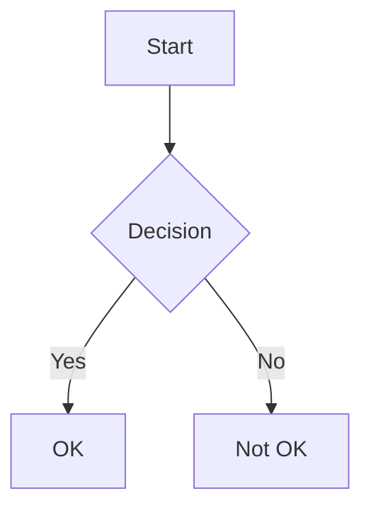

# Main Heading

A paragraph with **bold**, *italic*, and `inline code`.

## Section Two

- unordered item 1
- unordered item 2

1. ordered item 1
2. ordered item 2

> A blockquote with some wisdom.


### Code Example

```javascript
function hello() {
  console.log("Hello, World! This is a very long line that should wrap within the available content width to avoid horizontal overflow");
}
```

### A Table

| Column A | Column B | Column C |
|----------|----------|----------|
| row 1a   | row 1b   | row 1c   |
| row 2a   | row 2b   | row 2c   |


